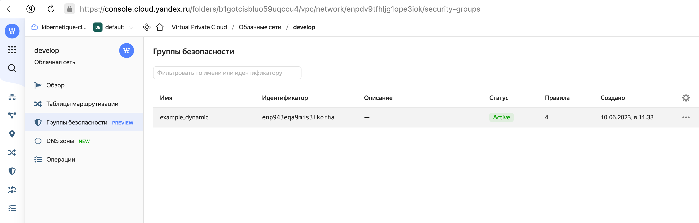
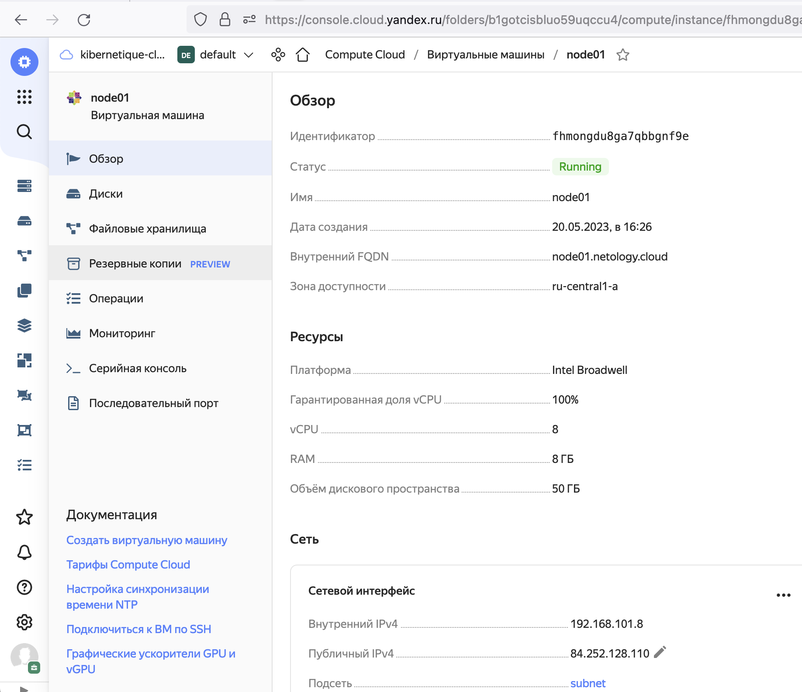
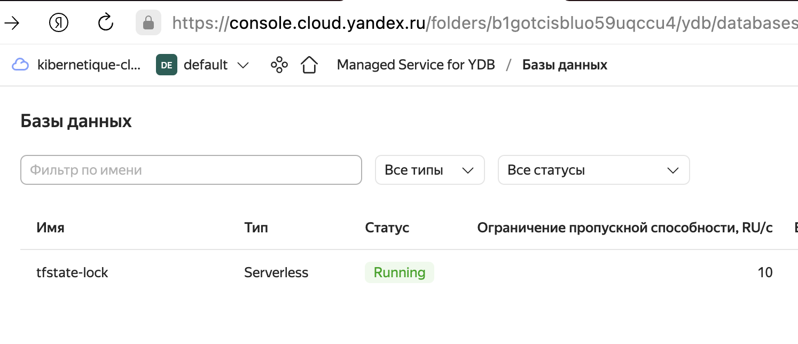
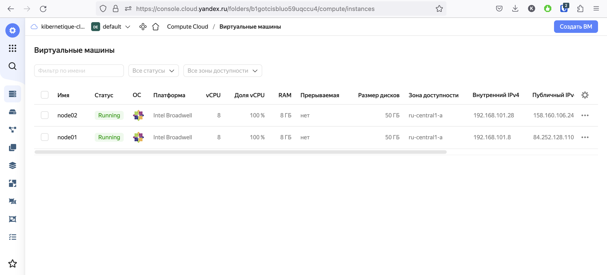
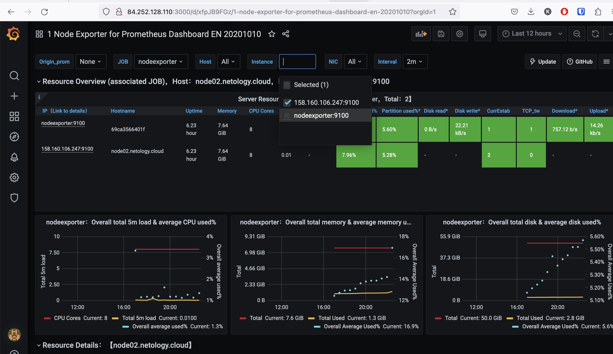

# Задача 1
<p align="center">
  
</p>

# Задача 2
<p align="center">
  
</p>

```yandex_compute_instance.node01: Destroying... [id=fhm2d3isf2rus36oveeb]
yandex_compute_instance.node02: Creating...
yandex_compute_instance.node02: Still creating... [10s elapsed]
yandex_compute_instance.node01: Still destroying... [id=fhm2d3isf2rus36oveeb, 10s elapsed]
yandex_compute_instance.node01: Destruction complete after 19s
yandex_compute_instance.node01: Creating...
yandex_compute_instance.node02: Still creating... [20s elapsed]
yandex_compute_instance.node01: Still creating... [10s elapsed]
yandex_compute_instance.node02: Still creating... [30s elapsed]
yandex_compute_instance.node01: Still creating... [20s elapsed]
yandex_compute_instance.node02: Still creating... [40s elapsed]
yandex_compute_instance.node02: Creation complete after 46s [id=fhmdjqvlpbudi05vbmda]
yandex_compute_instance.node01: Still creating... [30s elapsed]
yandex_compute_instance.node01: Still creating... [40s elapsed]
yandex_compute_instance.node01: Creation complete after 47s [id=fhmongdu8ga7qbbgnf9e]

Apply complete! Resources: 2 added, 0 changed, 1 destroyed.

Outputs:

external_ip_address_node01_yandex_cloud = "84.252.128.110"
external_ip_address_node02_yandex_cloud = "158.160.106.247"
internal_ip_address_node01_yandex_cloud = "192.168.101.8"
internal_ip_address_node02_yandex_cloud = "192.168.101.28"
```

# Задача 3
```[centos@node01 ~]$ sudo docker ps
CONTAINER ID   IMAGE                              COMMAND                  CREATED       STATUS                 PORTS                                                                              NAMES
86526a9c81ca   grafana/grafana:7.4.2              "/run.sh"                7 hours ago   Up 7 hours             3000/tcp                                                                           grafana
69ca3566401f   prom/node-exporter:v0.18.1         "/bin/node_exporter …"   7 hours ago   Up 7 hours             9100/tcp                                                                           nodeexporter
1f1f213822c3   gcr.io/cadvisor/cadvisor:v0.47.0   "/usr/bin/cadvisor -…"   7 hours ago   Up 7 hours (healthy)   8080/tcp                                                                           cadvisor
2fa8ce5ba249   prom/prometheus:v2.17.1            "/bin/prometheus --c…"   7 hours ago   Up 24 minutes          9090/tcp                                                                           prometheus
3f349a792a15   prom/pushgateway:v1.2.0            "/bin/pushgateway"       7 hours ago   Up 7 hours             9091/tcp                                                                           pushgateway
75c30674e404   stefanprodan/caddy                 "/sbin/tini -- caddy…"   7 hours ago   Up 7 hours             0.0.0.0:3000->3000/tcp, 0.0.0.0:9090-9091->9090-9091/tcp, 0.0.0.0:9093->9093/tcp   caddy
2aaf3ecb96ef   prom/alertmanager:v0.20.0          "/bin/alertmanager -…"   7 hours ago   Up 7 hours             9093/tcp                                                                           alertmanager
```  

# Задача 4
<p align="center">
  
</p>

# Задача 5
<p align="center">
  
</p>

<p align="center">
  
</p>