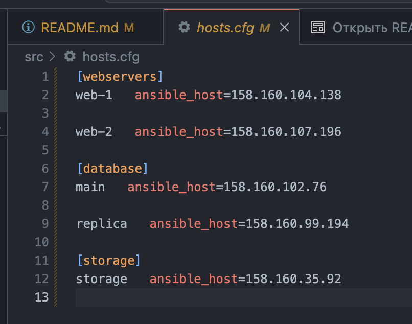

# Задание 1
1. Возьмите код:
- из [ДЗ к лекции №04](https://github.com/netology-code/ter-homeworks/tree/main/04/src) 
- из [демо к лекции №04](https://github.com/netology-code/ter-homeworks/tree/main/04/demonstration1).
2. Проверьте код с помощью tflint и checkov. Вам не нужно инициализировать этот проект.
3. Перечислите какие **типы** ошибок обнаружены в проекте (без дублей).
```
yura@Skynet src % tflint --format=compact
4 issue(s) found:

providers.tf:3:14: Warning - Missing version constraint for provider "yandex" in `required_providers` (terraform_required_providers)
variables.tf:43:1: Warning - variable "vm_web_name" is declared but not used (terraform_unused_declarations)
variables.tf:36:1: Warning - variable "vms_ssh_root_key" is declared but not used (terraform_unused_declarations)
variables.tf:50:1: Warning - variable "vm_db_name" is declared but not used (terraform_unused_declarations)
```
Первый говорит о том что не указан рекомендуемый параметр, другие указывают на то, что переменные обьявлены и не используются.

```
yura@Skynet demonstration1 % tflint --format=compact
6 issue(s) found:

main.tf:33:21: Warning - Module source "git::https://github.com/udjin10/yandex_compute_instance.git?ref=main" uses a default branch as ref (main) (terraform_module_pinned_source)
main.tf:3:14: Warning - Missing version constraint for provider "yandex" in `required_providers` (terraform_required_providers)
main.tf:51:1: Warning - Missing version constraint for provider "template" in `required_providers` (terraform_required_providers)
variables.tf:22:1: Warning - variable "default_cidr" is declared but not used (terraform_unused_declarations)
variables.tf:28:1: Warning - variable "vpc_name" is declared but not used (terraform_unused_declarations)
variables.tf:34:1: Warning - variable "public_key" is declared but not used (terraform_unused_declarations)
```
Здесь аналогично предыдущим предупреждениям и добавился в начале и говорит о том что ссылка на модуль использует ветку по умолчанию

```
yura@Skynet devops-netology % checkov -d ./src
[ terraform framework ]: 100%|████████████████████|[3/3], Current File Scanned=variables.tf
[ secrets framework ]: 100%|████████████████████|[4/4], Current File Scanned=./src/variables.tf

yura@Skynet devops-netology % checkov -d ./demonstration1
2023-06-19 21:48:50,992 [MainThread  ] [WARNI]  Failed to download module git::https://github.com/udjin10/yandex_compute_instance.git?ref=main:None (for external modules, the --download-external-modules flag is required)
[ kubernetes framework ]: 100%|████████████████████|[1/1], Current File Scanned=cloud-init.yml
[ terraform framework ]: 100%|████████████████████|[2/2], Current File Scanned=variables.tf
[ secrets framework ]: 100%|████████████████████|[3/3], Current File Scanned=./demonstration1/variables.tf
[ ansible framework ]: 100%|████████████████████|[1/1], Current File Scanned=cloud-init.yml
```

# Задание 2
1. Возьмите ваш GitHub репозиторий с **выполненным ДЗ №4** в ветке 'terraform-04' и сделайте из него ветку 'terraform-05'
2. Повторите демонстрацию лекции: настройте YDB, S3 bucket, yandex service account, права доступа и мигрируйте State проекта в S3 с блокировками. Предоставьте скриншоты процесса в качестве ответа.
3. Закомитьте в ветку 'terraform-05' все изменения.
4. Откройте в проекте terraform console, а в другом окне из этой же директории попробуйте запустить terraform apply.
5. Пришлите ответ об ошибке доступа к State.
6. Принудительно разблокируйте State. Пришлите команду и вывод.

<p align="center">
  
</p>

<p align="center">
  
</p>

<p align="center">
  
</p>

<p align="center">
  
</p>

Перенес state в бакет
```
yura@Skynet src % terraform init -backend-config="access_key=*****" -backend-config="secret_key=*****"

Initializing the backend...
Initializing modules...

Initializing provider plugins...
- Reusing previous version of yandex-cloud/yandex from the dependency lock file
- Reusing previous version of hashicorp/template from the dependency lock file
- Using previously-installed yandex-cloud/yandex v0.93.0
- Using previously-installed hashicorp/template v2.2.0

Terraform has been successfully initialized!

You may now begin working with Terraform. Try running "terraform plan" to see
any changes that are required for your infrastructure. All Terraform commands
should now work.

If you ever set or change modules or backend configuration for Terraform,
rerun this command to reinitialize your working directory. If you forget, other
commands will detect it and remind you to do so if necessary.
```
Запустил terraform console в одной вкладке и terraform apply в другой

```
yura@Skynet src % terraform apply
Acquiring state lock. This may take a few moments...
╷
│ Error: Error acquiring the state lock
│
│ Error message: ConditionalCheckFailedException: Condition not satisfied
│ Lock Info:
│   ID:        f5a3a13e-c8bb-6841-c248-55582acfbfc7
│   Path:      tfstate-object/terraform.tfstate
│   Operation: OperationTypeInvalid
│   Who:       yura@Skynet.local
│   Version:   1.4.6
│   Created:   2023-06-19 20:19:08.327605 +0000 UTC
│   Info:
│
│
│ Terraform acquires a state lock to protect the state from being written
│ by multiple users at the same time. Please resolve the issue above and try
│ again. For most commands, you can disable locking with the "-lock=false"
│ flag, but this is not recommended.
```
Разблокировал принудительно state
```
yura@Skynet src % terraform force-unlock f5a3a13e-c8bb-6841-c248-55582acfbfc7
Do you really want to force-unlock?
  Terraform will remove the lock on the remote state.
  This will allow local Terraform commands to modify this state, even though it
  may still be in use. Only 'yes' will be accepted to confirm.

  Enter a value: yes

Terraform state has been successfully unlocked!

The state has been unlocked, and Terraform commands should now be able to
obtain a new lock on the remote state.
```
