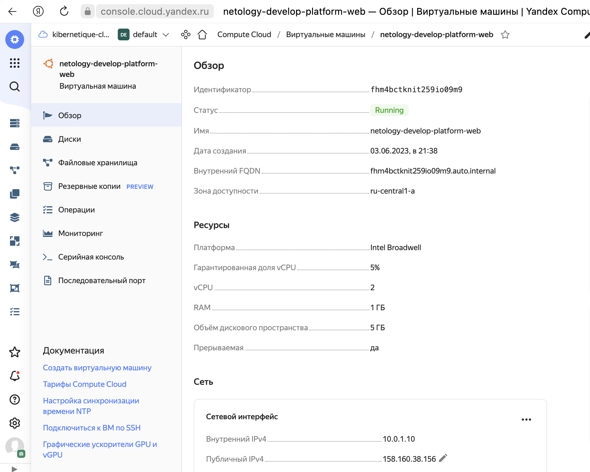
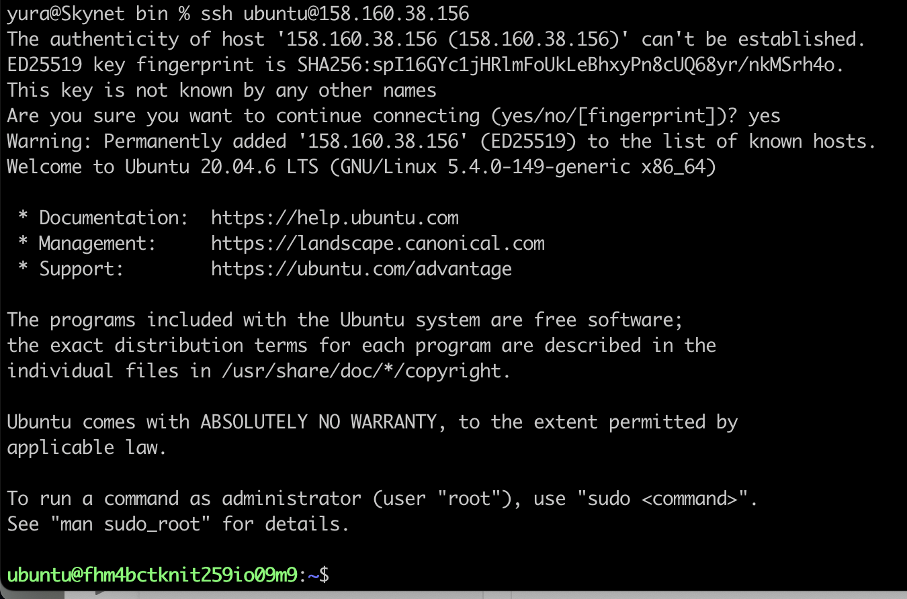

# Задание 1
```
1. Изучите проект. В файле variables.tf объявлены переменные для yandex provider.
2. Переименуйте файл personal.auto.tfvars_example в personal.auto.tfvars. Заполните переменные (идентификаторы облака, токен доступа). Благодаря .gitignore этот файл не попадет в публичный репозиторий. Вы можете выбрать иной способ безопасно передать секретные данные в terraform.
3. Сгенерируйте или используйте свой текущий ssh ключ. Запишите его открытую часть в переменную vms_ssh_root_key.
4. Инициализируйте проект, выполните код. Исправьте намеренное допущенные ошибки. Ответьте в чем заключается их суть?
5. Ответьте, как в процессе обучения могут пригодиться параметрыpreemptible = true и core_fraction=5 в параметрах ВМ? Ответ в документации Yandex cloud.
```
Ответ:
```
Error: Error while requesting API to create instance: server-request-id = 3898dd6f-26da-406a-9745-45789ad1137f server-trace-id = 975e01183b35450c:bc9efed154e148f8:975e01183b35450c:1 client-request-id = 49c0d969-4f85-407a-a1a9-1b56231faa4c client-trace-id = 63af39f3-3c39-495a-bfd9-815ad9194356 rpc error: code = InvalidArgument desc = the specified number of cores is not available on platform "standard-v1"; allowed core number: 2, 4
```
Ошибка значит что значение 1 не поддерживается конфигурации с этим типом ВМ, нужно выбрать предложенное кол-во ядер.
<p align="center">
  
</p>
<p align="center">
  
</p>

- Параметр preemptible=true  
Созданные прерываемые ВМ доступны по более низкой цене и автоматически останавливаются если с момента запуска ВМ прошло 24 часа, для экономии средств.
https://cloud.yandex.ru/docs/compute/concepts/preemptible-vm  
- Параметр core_fraction=5
Определяет базовый уровень производительности vCPU в процентах, ВМ с уровнем производительности меньше 100% будут стоить дешевле.  
https://cloud.yandex.ru/docs/compute/concepts/performance-levels

# Задание 2
```
1. Изучите файлы проекта.
2. Замените все "хардкод" значения для ресурсов yandex_compute_image и yandex_compute_instance на отдельные переменные. К названиям переменных ВМ добавьте в начало префикс vm_web_ . Пример: vm_web_name.
3. Объявите нужные переменные в файле variables.tf, обязательно указывайте тип переменной. Заполните их default прежними значениями из main.tf.
4. Проверьте terraform plan (изменений быть не должно).
```
https://github.com/kibernetiq/devops-netology/blob/terraform-02/src/variables.tf#L39-L49
# Задание 3
```
1. Создайте в корне проекта файл 'vms_platform.tf' . Перенесите в него все переменные первой ВМ.
2. Скопируйте блок ресурса и создайте с его помощью вторую ВМ(в файле main.tf): "netology-develop-platform-db" , cores = 2, memory = 2, core_fraction = 20. Объявите ее переменные с префиксом vm_db_ в том же файле('vms_platform.tf').
3. Примените изменения.
```
https://github.com/kibernetiq/devops-netology/blob/terraform-02/src/vms_platform.tf#L5-L7
# Задание 4
```
1. Объявите в файле outputs.tf output типа map, содержащий { instance_name = external_ip } для каждой из ВМ.
2. Примените изменения.
```
```
Outputs:

db = "158.160.97.107"
web = "158.160.40.243"
```
https://github.com/kibernetiq/devops-netology/blob/terraform-02/src/outputs.tf
# Задание 5
```
1. В файле locals.tf опишите в одном local-блоке имя каждой ВМ, используйте интерполяцию ${..} с несколькими переменными по примеру из лекции.
2. Замените переменные с именами ВМ из файла variables.tf на созданные вами local переменные.
3. Примените изменения.
```
https://github.com/kibernetiq/devops-netology/blob/terraform-02/src/locals.tf  
https://github.com/kibernetiq/devops-netology/blob/terraform-02/src/main.tf#L16

# Задание 6
```
1. Вместо использования 3-х переменных ".._cores",".._memory",".._core_fraction" в блоке resources {...}, объедените их в переменные типа map с именами "vm_web_resources" и "vm_db_resources".
2. Так же поступите с блоком metadata {serial-port-enable, ssh-keys}, эта переменная должна быть общая для всех ваших ВМ.
3. Найдите и удалите все более не используемые переменные проекта.
4. Проверьте terraform plan (изменений быть не должно).
```
https://github.com/kibernetiq/devops-netology/blob/terraform-02/src/vms_platform.tf#L22-L25  
https://github.com/kibernetiq/devops-netology/blob/terraform-02/src/main.tf#L36-L39 

# Задание 7
```
1. Напишите, какой командой можно отобразить второй элемент списка test_list?
2. Найдите длину списка test_list с помощью функции length(<имя переменной>).
3. Напишите, какой командой можно отобразить значение ключа admin из map test_map ?
4. Напишите interpolation выражение, результатом которого будет: "John is admin for production server based on OS ubuntu-20-04 with X vcpu, Y ram and Z virtual disks", используйте данные из переменных test_list, test_map, servers и функцию length() для подстановки значений.
```
```
yura@Skynet src % terraform console
> local.test_list[1]
"staging"

> length(local.test_list)
3

> lookup(local.test_map, "admin", "not found")
"John"

> "${lookup(local.test_map, "admin", "not found")} is ${keys(local.test_map)[0]} for ${local.test_list[2]} server based on OS ${local.servers.production.image} with ${local.servers.production.cpu} cpu, ${local.servers.production.ram} ram and ${length(local.servers.production.disks)} virtual disks"
"John is admin for production server based on OS ubuntu-20-04 with 10 cpu, 40 ram and 4 virtual disks"
```